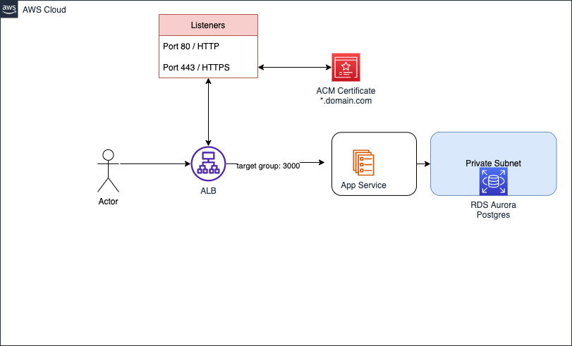

<h2> AWS Architecture </h2>

 * 1 EC2 instance: t2.micro 

 * 1 postgres RDS instance: db.t2.micro, Engine version: postgres 12.10

 * 1 Application load balancer 

 EC2 USERDATA will be used to build and start webserver. 
 

<h3> Security: </h3>

 EC2 and RDS should be launched in private subnets and the VMs should be behind the application LB 

 Only EC2 with defined security group can access RDS and RDS won't have internet access 

<h2> Prerequisite </h2>

    1. AWS CLI installed, Terraform v0.11.11 

    2. aws configure or attach IAM profile with the node 

    3. VPC created in advance 

    4. private and public subnets created in advance 

    5. SSL certificates created/imported in advance 

<h2> STEPS: </h2>

 
Clone this repo using command <code>  git clone https://github.com/manojbakkar/TechChallenge.git </code>

 
 Go to project folder         <code>  cd TechChallenge </code>

 
Initialize terraform          <code>  terraform init</code>

 
Change database and aws setting in terraform.tfvars file </code>

 
View Plan using                <code> terraform plan  </code>

 
Apply the plan using           <code> terraform apply </code>

 
 
The ALB DNS name will be displayed in terraform apply output. Use that URL with https in your browser.

 
